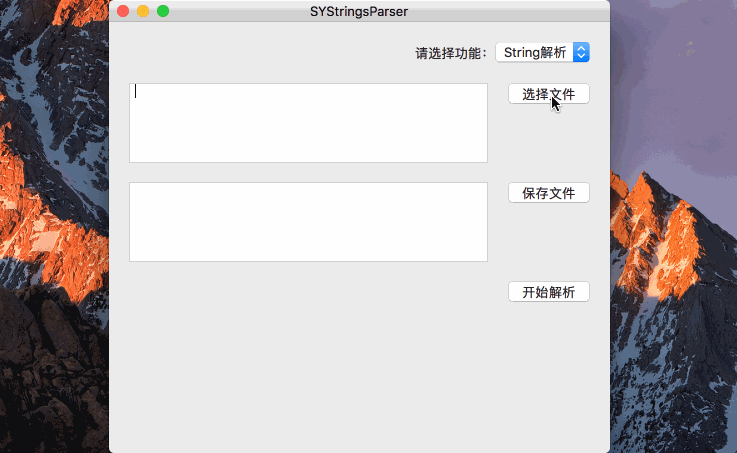
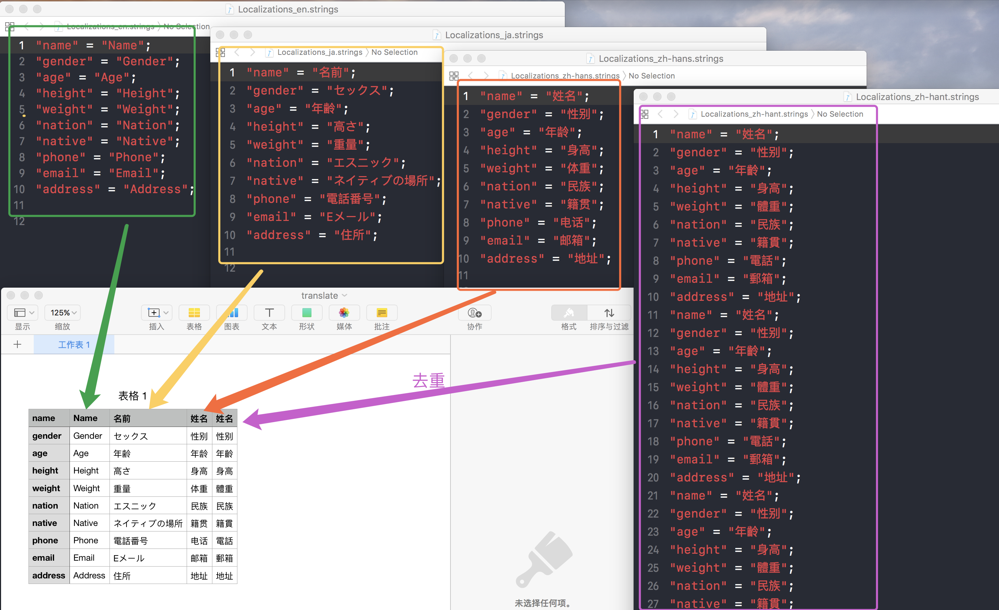
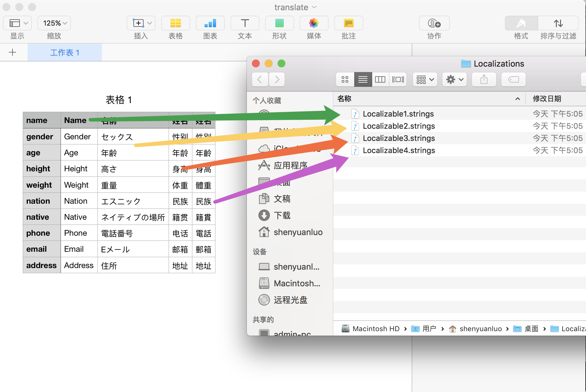
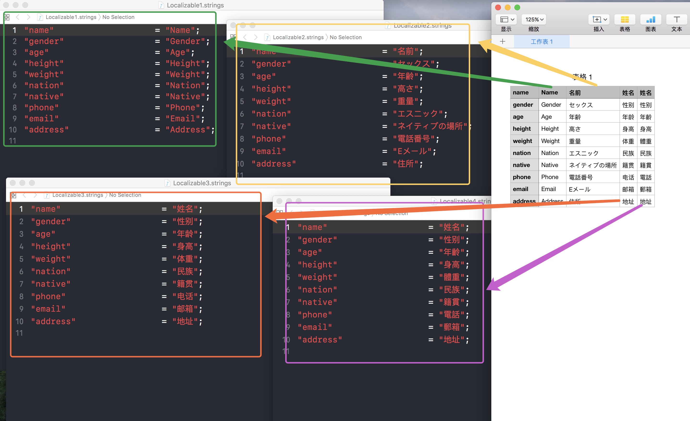

# SYStringsParser

## 功能
1. 便捷地把多个 `Localizable.strings` 文件合并转为一个 `csv`文件。

	
	
2. 同时支持把 `csv` 转化为多个 `Localizable.strings ` 文件。

	
	
	
3. 同时支持去重，保证对同一 `key` 的翻译唯一性。

	

## 版本

#### V 0.1.0 

1. 加入工程代码

## 历史 - Localizations 之痛
1. 在对 iOS APP 开发时，不可避免需要对 APP 进行**多语言化**，特别是做 [ODM](https://zh.wikipedia.org/wiki/ODM) 的开发，更需要实现 APP 国际化。
2. 当订单不断的来时，意味着需要不断地适配多语言化；此时就需要先把工程代码里面已有的 `Localizable.strings ` 导出到 `xls` 文档，然后再给相应的翻译部门或者外包翻译公司进行翻译。遗憾的是 Xcode 没有提供便捷地把 `Localizable.strings ` 导出到 `xls` 或 `csv` 的功能（或者有而我并没有发现。）最后，这一简单而又非常繁琐的工作就落在了 `Comm+C` 和  `Comm+V` 身上了；如果是一百几十个还好，但如果是成千上万的，那是得多大的工作量啊，宝贵的时间就这样白白浪费了，而且还不能保证复制、粘贴过程中不会出错。
3. 接了几次多语言化适配的我，已经疲惫不堪，下定决心做个简单的**解释器**出来，来缓解工作量，同时节省时间成本。于是乎，基于命令行解析的[版本](https://github.com/shenyuanluo/CSVParseAndExport)诞生了。
